# CI/CD Pipeline with Jenkins, Maven & Tomcat (AWS EC2)

A simple end-to-end CI/CD pipeline that builds a Java web application with Maven and automatically deploys it to Tomcat servers running on AWS EC2, using Jenkins for orchestration.

## What this project does

Every time the pipeline runs, it:

1. Pulls source code from GitHub
2. Builds a `.war` file using Maven
3. Archives the build artifact
4. Triggers a downstream job that copies the artifact and deploys it to a Tomcat server (testing environment)
5. From there, the same artifact is also deployed to a second Tomcat server (production environment)

The goal was to get hands-on with a real (if small) CI/CD workflow instead of just reading about one — provisioning servers, wiring Jenkins jobs together, configuring Tomcat manager access, and watching a build go from `git push` to a running webpage.

## Architecture

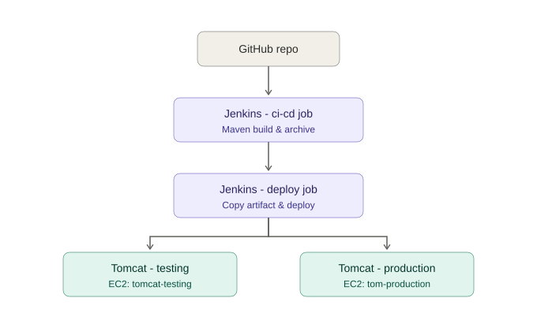

**Infrastructure (AWS, Mumbai region - ap-south-1):**

| Instance         | Purpose                            | Type            |
|------------------|-------------------------------------|-----------------|
| `jenkins-server` | Runs Jenkins (CI/CD orchestration)  | m7i-flex.large  |
| `tomcat-testing` | Testing/staging deployment target   | m7i-flex.large  |
| `tom-production` | Production deployment target        | m7i-flex.large  |

## Tech stack

- **Jenkins** (freestyle jobs) - build & deploy orchestration
- **Maven** - build tool (`mvn package`)
- **Apache Tomcat 9** - application server (two separate instances)
- **Deploy to Container** Jenkins plugin - handles the WAR deployment over the Tomcat Manager API
- **Git / GitHub** - source control
- **AWS EC2** - hosting for Jenkins and both Tomcat environments

## How the Jenkins jobs are set up

**Job 1: `ci-cd` (build job)**
- Source Code Management: Git, pulling from a GitHub repo, `*/master` branch
- Build step: Invoke top-level Maven targets → `package`
- Post-build actions:
  - Archive the artifacts (`**/*.war`)
  - Build other projects → triggers `testingtomcat` (only if the build is stable)

**Job 2: `testingtomcat` (deploy job)**
- Build step: Copy artifacts from another project (`ci-cd`, latest successful build, `**/*.war`)
- Post-build action: Deploy war/ear to a container
  - Deploys to **Tomcat 9.x (testing)** using stored credentials, context path `webapp`
  - A second container block deploys the same artifact to **Tomcat 9.x (production)** using separate credentials, context path `prod webapp`

Tomcat manager access on both servers is configured through `tomcat-users.xml`, with a dedicated manager user (`manager-gui`, `manager-script`, `manager-status` roles) so Jenkins can deploy remotely without using the default admin account.

## Result

Once a build succeeds, the app is live on both environments — confirmed by hitting the deployed context path directly in the browser (a basic "Hello, World!" page) and by checking the Tomcat Web Application Manager, which shows the app listed and running with an active session.

## Screenshots

| | |
|---|---|
| Jenkins dashboard | 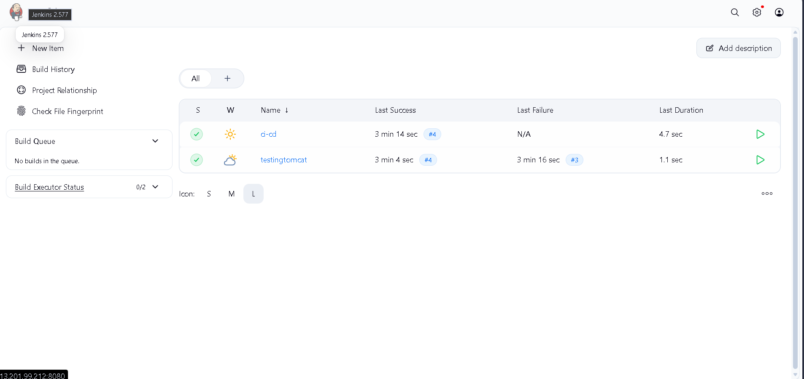 |
| Maven build log (BUILD SUCCESS) | 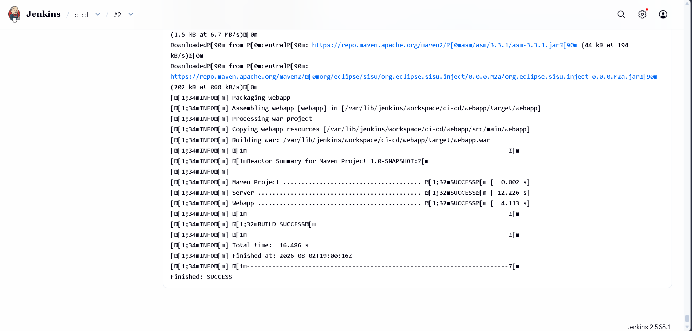 |
| `ci-cd` job - source code management | 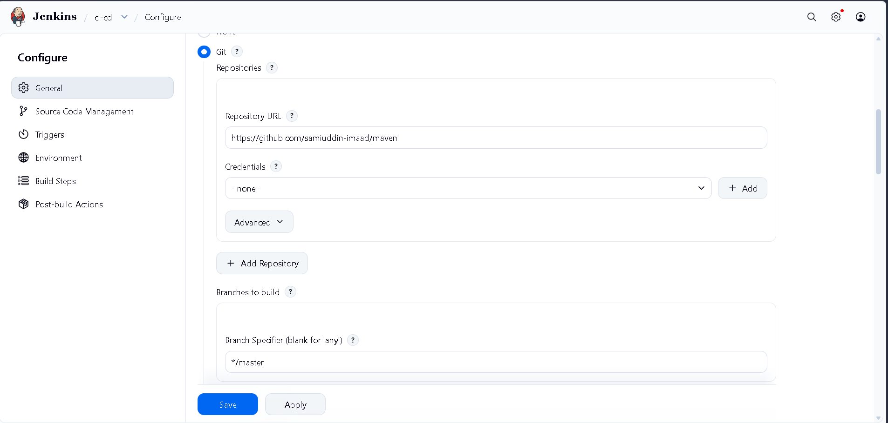 |
| `ci-cd` job - build steps | 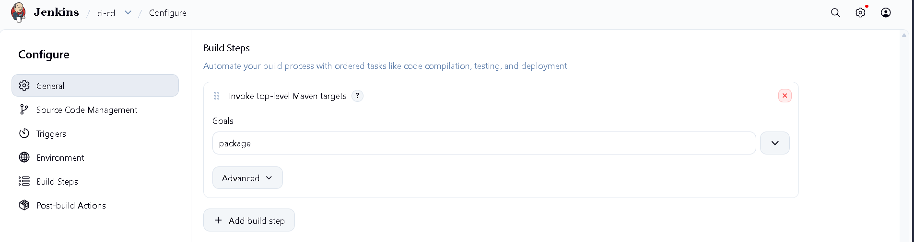 |
| `ci-cd` job - post-build actions | 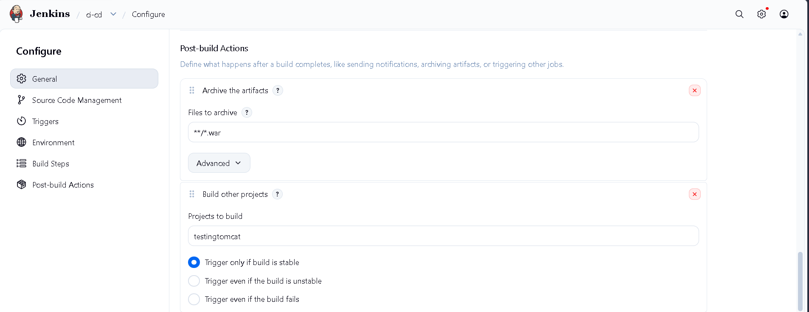 |
| `ci-cd` job - deploy to container (testing) | 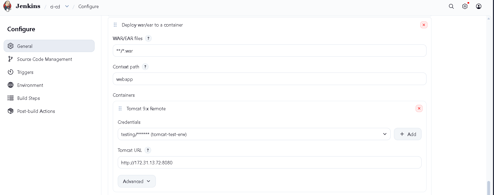 |
| `testingtomcat` job - copy artifacts | 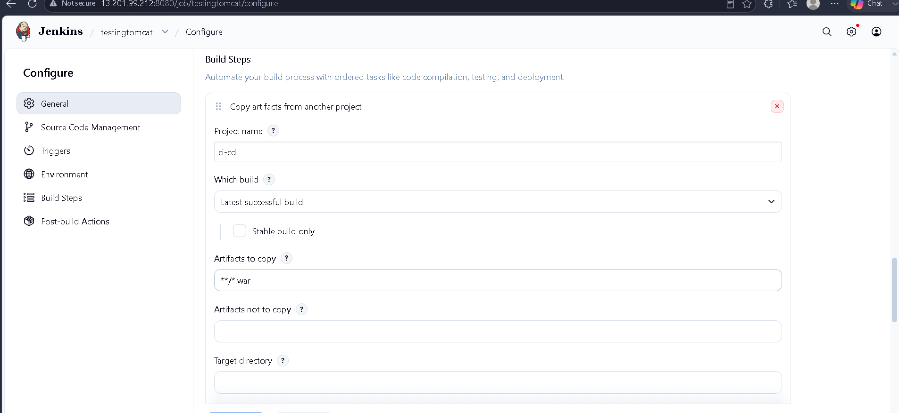 |
| `testingtomcat` job - deploy to container (production) | 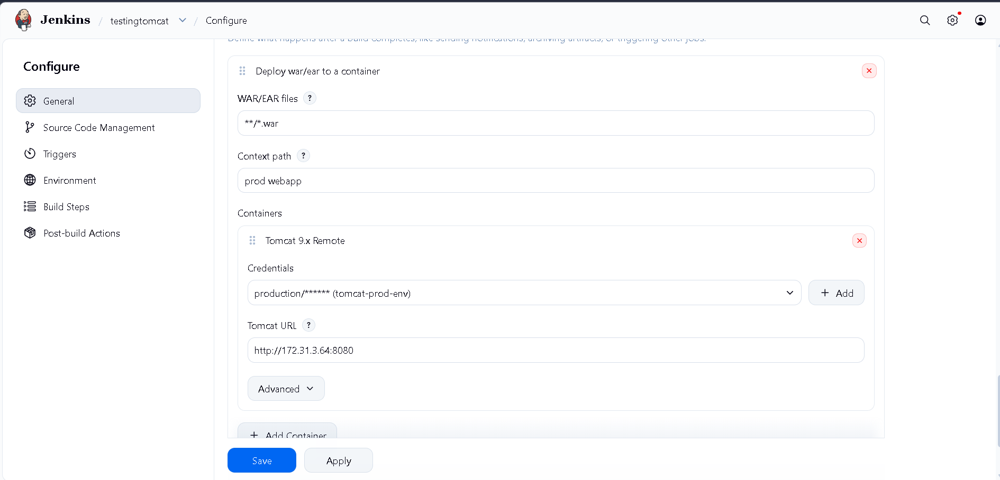 |
| Tomcat manager - `tomcat-users.xml` | 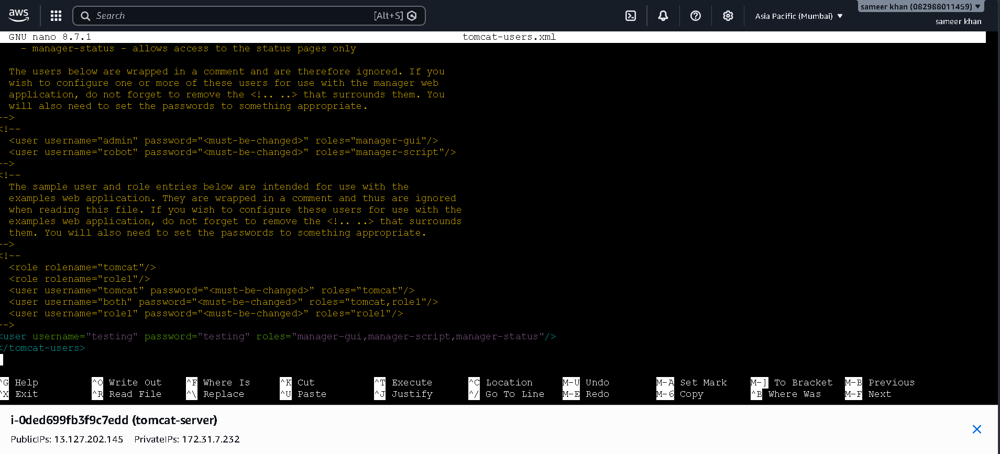 |
| Tomcat Web Application Manager (deployed apps) | 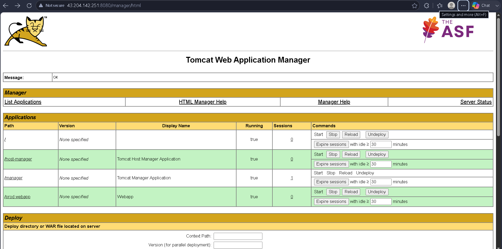 |
| Deployed app - testing environment | 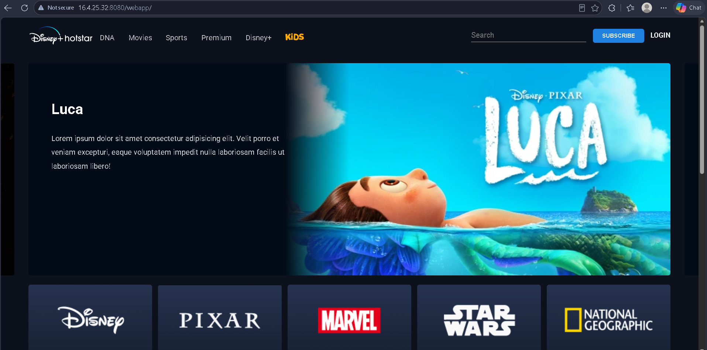 |
| Deployed app - production environment | 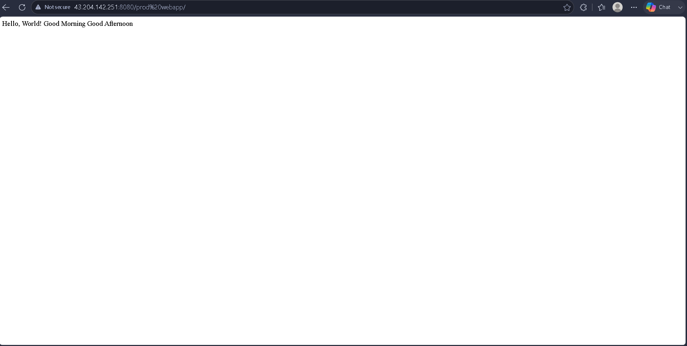 |
| EC2 instances (Jenkins + both Tomcat servers) | 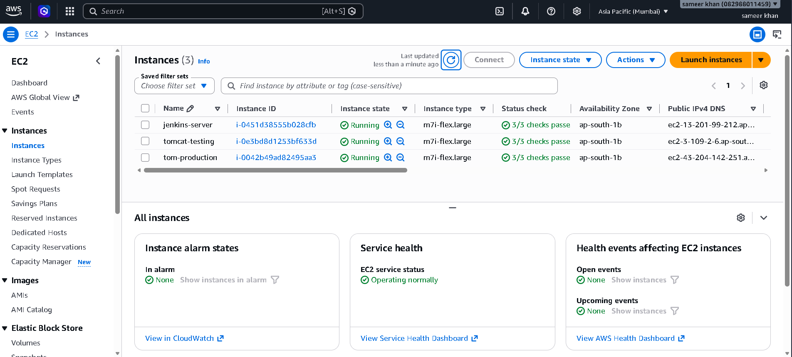 |

More screenshots are available in the [`screenshots/`](screenshots) folder.

## What I'd improve next

This was mainly a learning project to understand how the pieces of a CI/CD pipeline fit together, so there's a fair bit I'd clean up in a "real" setup:

- Move from Jenkins freestyle jobs to a `Jenkinsfile` (pipeline-as-code)
- Avoid spaces in context paths (e.g. `prod webapp` → `prod-webapp`) — it gets URL-encoded (`%20`) and is a bad practice
- Serve Tomcat behind HTTPS instead of plain HTTP
- Add a manual approval / promotion step before deploying to production instead of both environments deploying automatically
- Add basic tests to the Maven build so `package` isn't the only quality gate
- Use a proper application instead of a static "Hello World" page to test real deployment behavior

## Author

Sameer Khan
# jenkins-maven-tomcat-cicd
